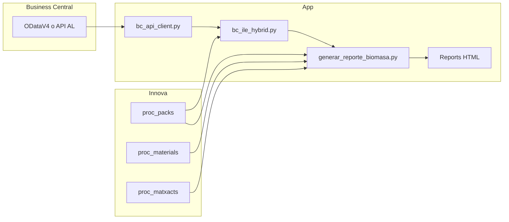

# Funcionamiento — CALCULO_BIOMASA

Cómo trabaja el informe de biomasa (**Stolt Sea Farm**).  
Reglas formales y SQL: [PREMISAS.md](PREMISAS.md).  
Definiciones de CHECK / estados / columnas: [docs/KPI_DEFINICIONES.md](docs/KPI_DEFINICIONES.md).  
Uso e instalación: [INSTRUCCIONES.md](INSTRUCCIONES.md).

---

## 1. Objetivo

Generar un **HTML** del periodo elegido que combina:

| Fuente | Aporta |
|--------|--------|
| **Innova** (SQL Server) | Entradas TINA, salidas CAJA, stock de tinas, merma, materiales |
| **Business Central** | Cruce por lote, balance almacenes **E / G / Z**, movimientos ILE Type 1/2/3 |

Salida: `Reports/reporte_biomasa_YYYYMMDD_YYYYMMDD.html`.

---

## 2. Flujo técnico



1. Lee Innova (premisas 1–5).
2. Con `BC_SOURCE=api`: descarga ILE E/G/Z (Type 1/2/3), enriquece lotes con Innova (`prday`, `weight`).
3. Cruza por lote: `proc_packs.number` = ILE `[Lot No.]`.
4. Calcula balances kg/cajas y escribe el HTML.

Módulos: `generar_reporte_biomasa.py`, `bc_api_client.py`, `bc_ile_hybrid.py`.

---

## 3. Innova (proceso)

| Concepto | Regla corta |
|----------|-------------|
| **TINA** | Entrada · `pkpackaging = 3` |
| **CAJA** | Salida · `pkpackaging <> 3` · `rtype = 1` |
| **Fecha** | `prday` (medianoche) |
| **Merma** | Entradas TINA − Salidas CAJA − Stock de tinas |
| **Nº de Cajas (KPI)** | `COUNT(*)` filas pack — **informativo**; no es la unidad del balance BC |

Detalle SQL: premisas 1–5 en [PREMISAS.md](PREMISAS.md).

**Limitación VAP:** entra como tina y no se procesa; distorsiona stock/merma. Nota fija al pie del informe.

---

## 4. Balance BC E/G/Z (oficial de stock)

Unidad de cajas del balance: **1 lote = 1 caja**  
(`number` Innova = `[Lot No.]` BC).  
`COUNT(*)` packs **no** entra en el teórico de cajas.

### Fórmula (kg y cajas)

```
Teórico = Stock inicial + Producción (Salidas CAJA) − Primera salida
CHECK / desvío = Real − Teórico
```

| Pieza | Significado |
|-------|-------------|
| **Stock inicial** | Empaque anterior al día/periodo; sin Type 1/3 antes |
| **Producción (Salidas CAJA)** | Alta de stock: lote en Innova CAJA **y** en ILE E/G/Z (`prday` / Fecha empaque) |
| **Primera salida** | Primera Type 1 o Type 3 del lote (**una sola vez**) |
| **Real** | Snapshot E/G/Z al cierre (empaque ≤ fecha, sin Type 1/3 hasta esa fecha) |
| **Merma peso** | Innova − BC del mismo lote (báscula); **no** altera el CHECK de stock |

**Producto:** si el lote está en ILE → **`Item No.` BC**. Conversion / pattern solo si es solo-Innova.

**LOTE REPETIDO:** si un `number` aparece >1 vez → alerta; el balance **sigue** contando 1 caja por lote.

### Estados globales (cajas)

| Estado | Condición | Semáforo |
|--------|-----------|----------|
| **A** | CHECK cajas = 0 y todos los productos = 0 (kg ≈ 0) | Verde |
| **B** | CHECK global = 0 y algún producto ≠ 0 | Amarillo |
| **C** | CHECK cajas global ≠ 0 | Rojo |
| **D** | CHECK cajas ≠ 0 y CHECK kg ≈ 0 | Rojo — inconsistencia cajas/kg |

Pares ±X solo con **evidencia de lote** (Conversion ≠ Item No.), no por suma casual.

Glosario: [docs/KPI_DEFINICIONES.md](docs/KPI_DEFINICIONES.md).

---

## 5. Dos lógicas BC (no confundir)

| | **Balance de almacén** | **Movimientos ILE** |
|--|------------------------|---------------------|
| Pestañas | Balance BC E/G/Z · Balance por tipo (cajas) | Movimientos ILE (T2/1/3) |
| Unidad | 1 lote = 1 caja / kg del lote | `ABS(Quantity)` / `ABS(Kilos)` |
| Fórmula | Inicial + Producción − 1ª salida | Inicial + T2 − T1 − T3 |
| Uso | ¿Cuadra el stock? | ¿Qué apuntes hizo BC? |

Si el stock cuadra y Movimientos ILE no, es **normal**: son unidades distintas.

---

## 6. Cruce Innova ↔ BC

- Clave: `number` = `[Lot No.]`
- Almacenes: **E, G, Z**
- Histórico ILE desde **2026-01-01** (apertura de stock)
- KPI típico: % lotes Innova CAJA con enlace BC; diferencia kg enlazados

Lotes **solo Innova** (sin ILE) no entran en la producción del balance E/G/Z → pueden generar CHECK negativo (falta real), p. ej. julio `RFM152P`.

---

## 7. Pestañas del HTML

| Pestaña | Contenido |
|---------|-----------|
| Introducción | Contexto y snapshot |
| Resumen | KPIs Innova + BC |
| Gráficas | Evolución diaria |
| Detalle diario | Día a día + Excel |
| Balance | Tinas, merma, arrastre |
| Cruce BC | Lotes con/sin enlace |
| Balance BC E/G/Z | Stock kg + CHECK por producto |
| Lotes del día | Solo si inicio = fin |
| Balance por tipo (cajas) | CHECK cajas, estados A–D |
| Movimientos ILE | Auditoría Type 2/1/3 |
| Stock inicial / final BC | Snapshot por producto |
| Análisis ILE | Type 1/2/3, alertas, usuario/día/producto |
| Materiales | Top entradas/salidas |
| Debug | SQL técnico (opcional) |

---

## 8. Análisis ILE (pestaña)

Sirve para **auditar apuntes**, no sustituye el balance de stock:

- Validación check kg vs cajas (misma base de lote)
- Resumen Type 1 / 2 / 3 (Quantity vs nº lotes, % Kilos=0)
- Type 3 por usuario / día / producto  
  (con ODataV4 el usuario suele salir como `(sin usuario)`)

---

## 9. Lectura rápida de un desvío

1. Mirar **estado A/B/C/D** y CHECK global kg/cajas.
2. Abrir **CHECK por producto** → el/los SKU con CHECK ≠ 0.
3. Contrastar: ¿hay lotes solo Innova? ¿stock real 0 con teórico > 0?
4. Si cajas ≠ 0 y kg = 0 → estado **D** (revisar mapeo / packs, no asumir merma física).
5. Si hay alerta **LOTE REPETIDO**, revisar esos `number` sin cambiar la regla 1 lote = 1 caja.

---

## 10. Mapa de documentación

| Documento | Rol (una sola fuente) |
|-----------|------------------------|
| **Este fichero** | Cómo funciona el sistema |
| [PREMISAS.md](PREMISAS.md) | Reglas canónicas + SQL |
| [docs/KPI_DEFINICIONES.md](docs/KPI_DEFINICIONES.md) | Glosario CHECK / estados / columnas |
| [INSTRUCCIONES.md](INSTRUCCIONES.md) | Instalar, `.env`, generar informe |
| [README.md](README.md) | Entrada + despliegue Windows |
| [docs/CAMBIOS_LOCAL.md](docs/CAMBIOS_LOCAL.md) | Historial de cambios |
| [docs/BC_API_AL_CONTRACT.md](docs/BC_API_AL_CONTRACT.md) | Por qué no usar API v2.0 sin lote |
| `docs/CREDENCIALES_LOCAL.md` | Secretos del puesto (no versionado) |
