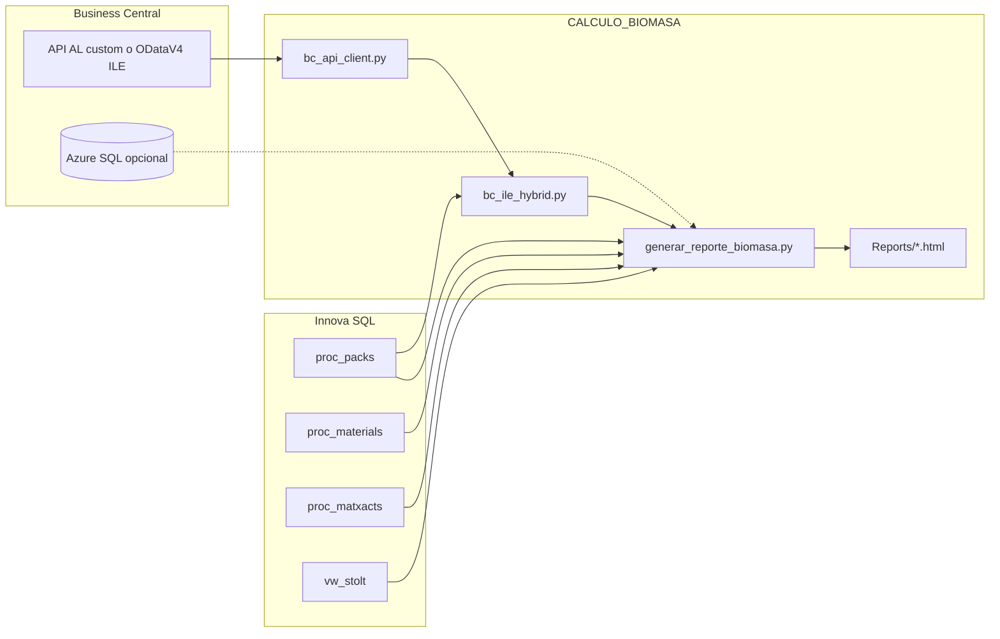

# Instrucciones — CALCULO_BIOMASA

Guía de uso y funcionamiento del informe de biomasa (**Stolt Sea Farm**).  
Reglas de negocio canónicas: [PREMISAS.md](PREMISAS.md).  
Contrato API BC: [docs/BC_API_AL_CONTRACT.md](docs/BC_API_AL_CONTRACT.md).  
Credenciales locales (no versionadas): `docs/CREDENCIALES_LOCAL.md`.

---

## 1. Qué hace el proyecto

Genera un **informe HTML** del periodo elegido que combina:

| Fuente | Qué aporta |
|--------|------------|
| **Innova** (SQL Server) | Entradas TINA, salidas CAJA, stock de tinas, merma, materiales |
| **Business Central** | Cruce por lote, balance almacenes **E/G**, movimientos ILE Type 1/2/3 |

Salida típica: `Reports/reporte_biomasa_YYYYMMDD_YYYYMMDD.html` (exportable a Excel desde el propio HTML).

**Referencia operativa validada:** abril 2026.

---

## 2. Instalación (una vez por PC)

### Requisitos

- Windows 10/11  
- Python 3.11+ (con *Add to PATH*)  
- Red corporativa a Innova (y a Internet/API BC si `BC_SOURCE=api`)

### Pasos

```bat
crear_entorno.bat
```

1. Crea `.venv` e instala `requirements.txt`.
2. Si no existe `.env`, cópielo desde `.env.example`.
3. Edite `.env` con sus credenciales (opción 2 del menú o Bloc de notas).

Menú completo:

```bat
Iniciar_Reporte_Biomasa.bat
```

---

## 3. Credenciales (`.env`)

**No compartir ni versionar** el fichero `.env`.

### Innova (obligatorio)

```
DB_SERVER=192.168.x.x
DB_NAME=Innova
DB_USER=AEV          # o biomasa_ro / su login solo-lectura
DB_PASSWORD=***
```

Alta de usuarios SQL solo-lectura:

```bat
python scripts/crear_usuario_innova_biomasa.py --login INICIALES --update-env
```

### Business Central (recomendado: API)

```
BC_SOURCE=api
CLIENT_ID=...
TENANT_ID=...
CLIENT_SECRET=...
BC_ENVIRONMENT=Produccion
COMPANY_ID=...
COMPANY_NAME=Stolt Sea Farm, S.A.
BC_API_PUBLISHER=stolt
BC_API_GROUP=biomasa
BC_API_VERSION=v1.0
BC_API_ENTITY=itemLedgerEntries
BC_API_PREFER_CUSTOM=1
```

- Si la **API AL custom** no está publicada, el cliente usa automáticamente **ODataV4** (`ItemLedgerEntries`) + kilos/`prday` desde Innova.
- Opcional: `BC_SERVER` / `BC_DATABASE` / `BC_USER` / `BC_PASSWORD` para `Conversion productos` o `BC_SOURCE=sql`.

Detalle de secretos por puesto: `docs/CREDENCIALES_LOCAL.md` (solo local).

---

## 4. Generar el informe

```bat
ejecutar_reporte.bat 01/04/2026 30/04/2026
```

O sin fechas (las pide):

```bat
ejecutar_reporte.bat
```

O con Python (venv activado):

```bat
python generar_reporte_biomasa.py --start 01/04/2026 --end 30/04/2026
```

Opciones útiles:

| Flag | Efecto |
|------|--------|
| `--bc-source api` / `sql` | Fuerza fuente BC (default: `BC_SOURCE` en `.env`) |
| `--skip-bc` | Solo Innova (sin cruce ni balance BC) |
| `--output ruta.html` | Ruta de salida |

---

## 5. Cómo funciona (arquitectura)



### Flujo de datos

1. **Innova:** KPIs de biomasa (premisas 1–5, 7) por `prday` / stock de tinas / merma.
2. **BC ILE E/G:** con `BC_SOURCE=api`, descarga movimientos Type 1/2/3 (OAuth), enriquece lote con Innova (`prday`, `weight`).
3. **Cruce:** `proc_packs.number` = `Lot No.` (almacenes E y G).
4. **Balances:**
   - **Stock (oficial):** Inicial + Empaque − Primera salida → check kg/cajas alineados.
   - **Movimientos ILE (auditoría):** Inicial + Type2 − Type1 − Type3 con `ABS(Quantity)` / `ABS(Kilos)` → el check puede ≠ 0.

### Módulos principales

| Fichero | Rol |
|---------|-----|
| `generar_reporte_biomasa.py` | Informe HTML, SQL Innova, balance, pestañas |
| `bc_api_client.py` | OAuth, paginación, custom API → OData |
| `bc_ile_hybrid.py` | Enrich Innova + agregación balance/cruce API |
| `scripts/crear_usuario_innova_biomasa.py` | Alta usuarios SQL solo-lectura |
| `contrastar_lote_innova_bc.py` | Validación lote Innova vs BC |
| `validate_bc_api_smoke.py` | Smoke test API + enrich |

---

## 6. Pestañas del informe HTML

| Pestaña | Contenido |
|---------|-----------|
| Introducción | Guía y premisas resumidas |
| Resumen | KPIs del periodo |
| Gráficas | Evolución diaria |
| Detalle diario | Tabla día a día + Excel |
| Balance | Stock tinas, merma, arrastre |
| Cruce BC | Lotes Innova ↔ BC, con/sin pedido |
| Balance BC E/G | Stock teórico/real en **kg** (almacenes E/G) |
| Balance por tipo (cajas) | Stock por producto: empaque / 1ª salida |
| **Movimientos ILE (T2/1/3)** | Auditoría Quantity/Kilos Type 2/1/3 |
| Stock inicial / final BC | Snapshot por producto |
| Análisis ILE | KPIs Type 3, gráficos, alertas |
| Materiales | Top entradas/salidas |
| Debug | SQL/trazas (técnico) |

---

## 7. Dos balances BC (no confundir)

| | **Balance de almacén** | **Movimientos ILE** |
|--|------------------------|---------------------|
| Pestañas | Balance BC E/G, Balance por tipo (cajas) | Movimientos ILE (T2/1/3) |
| Unidad | 1 lote = 1 caja / kg del lote | `ABS(Quantity)` / `ABS(Kilos)` |
| Fórmula | Inicial + Empaque − 1ª salida | Inicial + T2 − T1 − T3 |
| Check típico abril | **0** | Cajas **+71** (esperado) |
| Uso | ¿Cuadra el stock? | ¿Qué apuntes hizo BC? |

---

## 8. Problemas frecuentes

| Síntoma | Qué hacer |
|---------|-----------|
| Error login Innova | Revisar `DB_*` en `.env`; VPN/red |
| Error OAuth / BC API | Revisar `CLIENT_*`, `TENANT_ID`, `COMPANY_ID` |
| Timeout BC SQL | Subir `BC_TIMEOUT` o usar `BC_SOURCE=api` |
| Check cajas ≠ 0 en Movimientos ILE | Normal (Quantity≠1, Type 1+3, Kilos=0) |
| Check stock = 0 pero Movimientos ≠ 0 | Correcto: son lógicas distintas |
| Sin HTML | Mirar `Reports\` o `logs\` |

---

## 9. Cierre de proyecto — checklist

- [x] Informe Innova + BC (API híbrida / SQL)
- [x] Balance stock alineado kg/cajas
- [x] Pestaña auditoría movimientos ILE
- [x] Usuarios SQL solo-lectura (`biomasa_ro`, `AEV`, …)
- [x] Documentación: PREMISAS, README, este fichero, contrato API AL
- [ ] Publicar API AL custom en BC (IT) — pendiente opcional; OData sirve de puente
- [ ] Rotar `sa` / secretos de App Registration en producción según política IT

---

## 10. Contacto técnico

- Reglas de negocio: actualizar **PREMISAS.md** y constantes `PREMISA_*` / `SQL_*` en código.  
- API AL BC: equipo BT Cloud / DevOps BC ([contrato](docs/BC_API_AL_CONTRACT.md)).  
- Usuarios Innova: DBA con script en `scripts/`.
