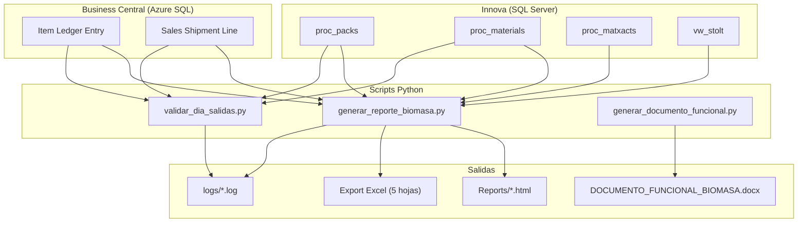
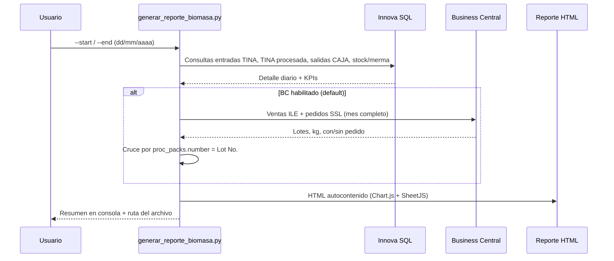
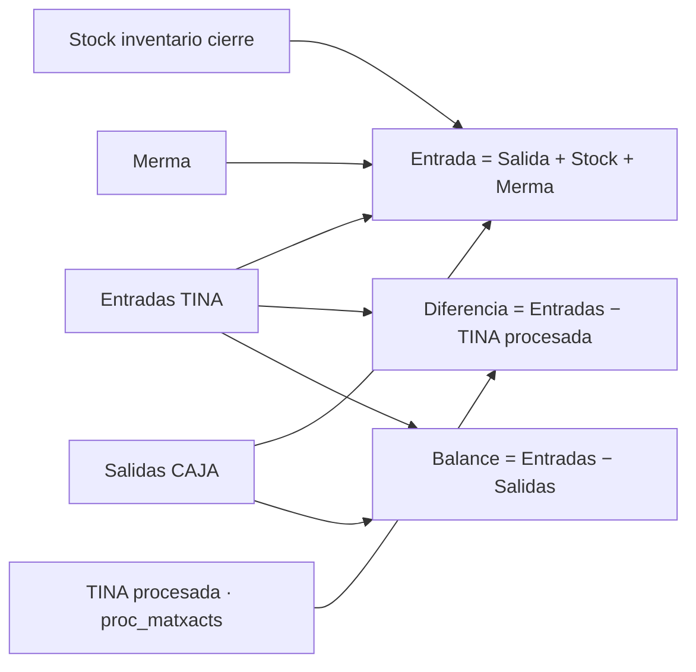
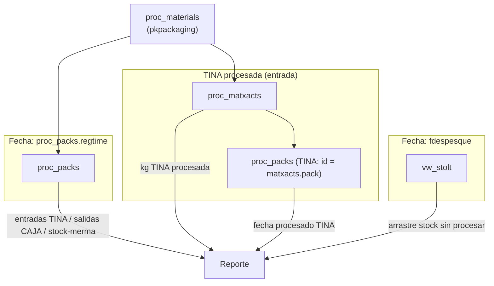
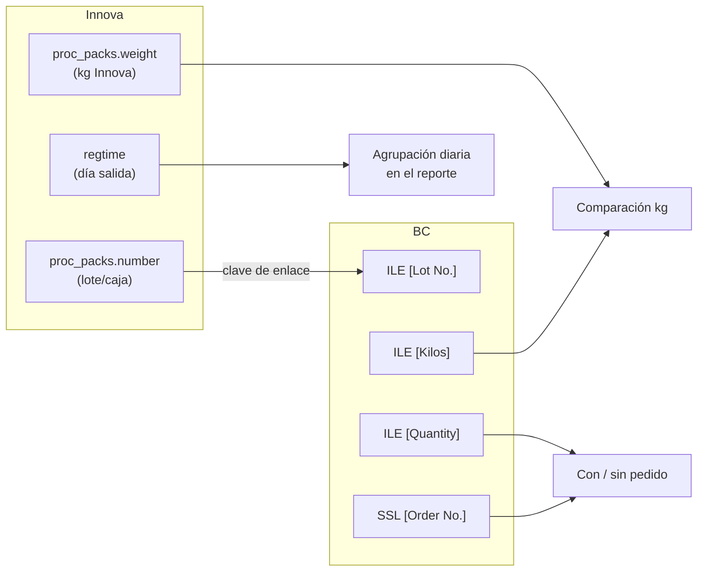
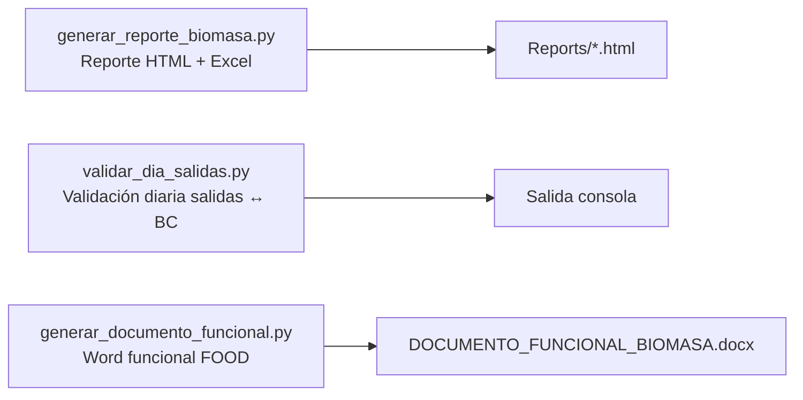
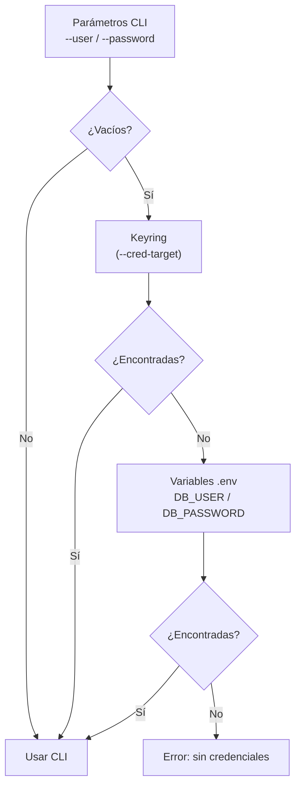

# CALCULO_BIOMASA

Herramienta de reporting para el seguimiento de biomasa en planta. Consolida datos de **Innova (SQL Server)** y **Business Central (Azure SQL)** en un informe HTML interactivo con KPIs, gráficas, tablas exportables y cruce ERP por lote.

Documento canónico de reglas de negocio: **[PREMISAS.md](PREMISAS.md)**.

## Terminología planta

| Término | Rol | En Innova |
|---------|-----|-----------|
| **TINA** | **Entrada** de biomasa | `proc_packs` con `pkpackaging = 3`; procesado en `proc_matxacts` |
| **CAJA** | **Salida** de producto | `proc_packs` con `pkpackaging <> 3` |

**TINA procesada (kg)** en `proc_matxacts` es entrada, no salida CAJA.

---

## Índice

1. [Arquitectura](#arquitectura)
2. [Flujo de generación del reporte](#flujo-de-generación-del-reporte)
3. [Premisas de negocio](#premisas-de-negocio)
4. [Fuentes de datos](#fuentes-de-datos)
5. [Cruce Innova — Business Central](#cruce-innova--business-central)
6. [Contenido del reporte HTML](#contenido-del-reporte-html)
7. [Scripts del proyecto](#scripts-del-proyecto)
8. [Instalación y ejecución](#instalación-y-ejecución)
9. [Configuración y credenciales](#configuración-y-credenciales)
10. [Totales de referencia](#totales-de-referencia)
11. [Mantenimiento](#mantenimiento)

---

## Arquitectura



---

## Flujo de generación del reporte



---

## Premisas de negocio

**Estado: validadas por negocio** (referencia marzo 2026, modo `legacy`).

La clasificación se basa en `proc_materials.pkpackaging`. La implementación vive en `generar_reporte_biomasa.py` (`PREMISA_*`, `SQL_*`) y se muestra en cada reporte HTML.



| # | Concepto | Regla |
|---|----------|-------|
| 1 | **Entrada TINA** | `m.pkpackaging = 3` |
| 2 | **Salida CAJA** | `m.pkpackaging <> 3 OR m.pkpackaging IS NULL` |
| 3 | **Stock** | Inventario TINA al cierre: stock inicial + Entradas − TINA procesada |
| 4 | **Merma** | **Entrada TINA − Salidas CAJA − Stock** (no es `rtype` Innova) |
| 5 | **TINA procesada (kg)** | `proc_matxacts`, `xactpath = 1`, `%tina%`; fecha = `proc_packs.regtime` de la tina |

| Métrica derivada | Fórmula |
|------------------|---------|
| Merma (kg) | Entradas TINA − Salidas CAJA − Stock |
| Diferencia (kg) | Entradas TINA − TINA procesada |
| Balance E-S (kg) | Entradas TINA − Salidas CAJA |
| % Merma | Merma / Entradas TINA × 100 |
| Stock sin procesar | Arrastre acumulado (Entradas TINA − TINA procesada o `vw_stolt` según modo) |
| Stock final teórico *(opcional)* | Stock inicial + Entradas TINA − TINA procesada |
| Ajuste conciliación *(opcional)* | Stock final teórico − Stock final físico |

> Detalle completo, totales de control y procedimiento de mantenimiento: **[PREMISAS.md](PREMISAS.md)**.

---

## Fuentes de datos

### Modo `legacy` (por defecto)



| Métrica | Tabla(s) | Campo fecha |
|---------|----------|-------------|
| Entradas TINA | `proc_packs` + `proc_materials` | `regtime` |
| Salidas CAJA | `proc_packs` + `proc_materials` | `regtime` |
| Stock / merma | `proc_packs` + `proc_materials` | `regtime` |
| TINA procesada (kg) | `proc_matxacts` + TINA (`proc_packs.id`) | `proc_packs.regtime` de la tina |
| Arrastre | `vw_stolt` + `proc_materials` | `fdespesque` |

### Modo `vw_stolt_despesque`

Entradas y salidas diarias desde `vw_stolt` por `fdespesque`. Stock y merma se calculan por balance de masa (no por `rtype`).

```bash
python generar_reporte_biomasa.py --start 01/03/2026 --end 31/03/2026 --data-source vw_stolt_despesque
```

---

## Cruce Innova — Business Central



| Concepto | Regla |
|----------|--------|
| Clave de enlace | `proc_packs.number` = `bc.[Item Ledger Entry].[Lot No.]` |
| Ventas BC | `Entry Type = 1` |
| Kg BC | `ABS([Kilos])` en ILE |
| Pedido | `[Order No.]` de `Sales Shipment Line` (mismo `[Document No.]`) |
| Con pedido | `[Order No.]` informado |
| Sin pedido | `[Order No.]` vacío o NULL |

El cruce es **por lote**, no por fecha: la contabilización BC puede caer en un día distinto al `regtime` Innova.

---

## Contenido del reporte HTML

Informe autocontenido en `Reports/reporte_biomasa_YYYYMMDD_YYYYMMDD.html`.

### KPIs de cabecera

- Entradas TINA, stock, merma, TINA procesada
- Diferencia (TINA − procesada) y balance TINA − CAJA
- Stock sin procesar a fin de periodo
- Cruce BC: lotes enlazados, kg Innova vs kg BC, con/sin pedido
- Validación de stock físico *(si se informan parámetros opcionales)*

### Gráficas interactivas (Chart.js)

- Evolución diaria: entradas TINA, TINA procesada y salidas CAJA
- Diferencia diaria y acumulada
- Composición del periodo (donut): stock TINA, merma, salidas CAJA, TINA procesada
- Stock vs merma diarios en entrada TINA
- Balance TINA − CAJA por día
- Todas maximizables en pantalla completa

### Tablas exportables

| Tabla | Export individual | Hoja Excel global |
|-------|-------------------|-------------------|
| Detalle diario | Sí | `Detalle diario` |
| Entradas, salidas, stock y merma | Sí | `Stock y merma` |
| Cruce Innova / BC por lote | Sí | `Cruce BC` |
| Top 15 materiales entrada | Sí | `Top entrada` |
| Top 15 materiales salida | Sí | `Top salida` |

Botón superior: **Exportar todo en Excel (5 hojas)** → `.xlsx` único.

Cada reporte incluye un bloque visible con las premisas y enlace a `PREMISAS.md`.

---

## Scripts del proyecto



### 1. `generar_reporte_biomasa.py`

Genera el reporte principal.

| Parámetro | Obligatorio | Default | Descripción |
|-----------|-------------|---------|-------------|
| `--start` | No* | — | Fecha inicio `dd/mm/aaaa` |
| `--end` | No* | — | Fecha fin `dd/mm/aaaa` |
| `--server` | No | `DB_SERVER` | Servidor Innova |
| `--database` | No | `DB_NAME` | Base Innova |
| `--user` / `--password` | No | env / keyring | Credenciales Innova |
| `--cred-target` | No | `biomasa_sql_innova` | Target keyring |
| `--save-creds` | No | — | Guarda credenciales en keyring |
| `--output` | No | `Reports/` auto | Ruta del HTML |
| `--title` | No | `Reporte de Biomasa` | Título del informe |
| `--stock-inicial` | No | — | Stock inicial (kg) o `auto` (arrastre mensual) |
| `--arrastre-mensual` | No | — | Calcula stock inicial encadenando cierre del mes anterior |
| `--stock-ancla` | No | 01/01 del ano | Mes ancla del encadenamiento (dd/mm/aaaa) |
| `--stock-ancla-kg` | No | 0 | Stock de apertura en el mes ancla (kg) |
| `--stock-final-fisico` | No | — | Stock final físico (kg) |
| `--data-source` | No | `legacy` | `legacy` o `vw_stolt_despesque` |
| `--skip-bc` | No | — | Omite consulta a Business Central |
| `--bc-server` … `--bc-password` | No | `BC_*` env | Credenciales BC |
| `--bc-timeout` | No | `600` | Timeout consulta BC (s) |
| `--bc-login-timeout` | No | `60` | Timeout login BC (s) |

\*Si faltan fechas, el script las solicita de forma interactiva.

### 2. `validar_dia_salidas.py`

Validación diaria: salidas Innova (`regtime`) vs ventas BC por lote.

| Parámetro | Obligatorio | Default | Descripción |
|-----------|-------------|---------|-------------|
| `--fecha` | **Sí** | — | Fecha salida Innova `dd/mm/aaaa` |
| `--max-detalle` | No | `30` | Filas de detalle por lote |
| `--bc-server` … `--bc-password` | No | `BC_*` env | Credenciales BC |

### 3. `generar_documento_funcional.py`

Regenera `DOCUMENTO_FUNCIONAL_BIOMASA.docx`. Sin parámetros CLI.

### Scripts auxiliares (Windows)

| Archivo | Uso |
|---------|-----|
| `crear_entorno.bat` | Crea `.venv` e instala dependencias |
| `ejecutar_reporte.bat` | `ejecutar_reporte.bat 01/04/2026 30/04/2026` |

---

## Instalación y ejecución

### Requisitos

- Python 3.11+
- Acceso de red a Innova (SQL Server) y, opcionalmente, Business Central (Azure SQL)
- Dependencias: `pymssql`, `keyring` (opcional, recomendado)

### Instalación

```bash
python -m pip install -r requirements.txt
```

O en Windows:

```bat
crear_entorno.bat
```

### Ejemplos

```bash
# Reporte mensual (modo legacy + cruce BC)
python generar_reporte_biomasa.py --start 01/04/2026 --end 30/04/2026

# Sin Business Central
python generar_reporte_biomasa.py --start 01/04/2026 --end 30/04/2026 --skip-bc

# Validación opcional de stock físico
python generar_reporte_biomasa.py --start 01/04/2026 --end 30/04/2026 --stock-inicial 120000 --stock-final-fisico 117500

# Arrastre mensual (stock inicial = cierre mes anterior, desde enero con stock 0)
python generar_reporte_biomasa.py --start 01/03/2026 --end 31/03/2026 --arrastre-mensual --skip-bc

# Contraste mensual (CSVs + CONTRASTE.md) — validar marzo antes de otros meses
python exportar_contraste_mes.py --start 01/03/2026 --end 31/03/2026 --arrastre-mensual --skip-bc

# Validación diaria salidas ↔ BC
python validar_dia_salidas.py --fecha 04/03/2026 --max-detalle 30

# Documento funcional Word
python generar_documento_funcional.py
```

PowerShell con variables de entorno:

```powershell
$env:DB_USER = "usuario"
$env:DB_PASSWORD = "***"
python .\generar_reporte_biomasa.py --start 01/04/2026 --end 30/04/2026
```

---

## Configuración y credenciales

### Archivo `.env` (raíz del proyecto)

```env
# Innova
DB_SERVER=192.168.14.236
DB_NAME=Innova
DB_USER=TU_USUARIO
DB_PASSWORD=TU_PASSWORD

# Business Central (Azure SQL)
BC_SERVER=bitmap-ssfprod-sqlsvr-01.database.windows.net
BC_DATABASE=bitmap-ssfprod-QLSRVPDE-sqldb
BC_USER=bitmap-ssfprod-dbsvc-01
BC_PASSWORD=TU_PASSWORD_BC

# Opcional
BC_TIMEOUT=600
BC_LOGIN_TIMEOUT=60
```

También se admiten líneas informales para BC: `Server Name:`, `Database:`, `User:`, `Password:`.

### Orden de resolución de credenciales Innova



> **No commitear** `.env` — contiene credenciales reales.

### Salidas y logs

| Ruta | Contenido |
|------|-----------|
| `Reports/reporte_biomasa_YYYYMMDD_YYYYMMDD.html` | Reporte principal |
| `logs/error_reporte_biomasa_*.log` | Detalle si falla la ejecución |

---

## Totales de referencia

Valores de control al regenerar informes con las premisas actuales.

### Marzo 2026 (validación negocio, `--arrastre-mensual`)

| Métrica | Valor |
|---------|-------|
| Entradas TINA | 665.081,58 kg |
| Salidas CAJA | 492.968,78 kg |
| Stock inventario cierre | 678.373,33 kg |
| **Merma** (E − S − Stock) | −506.260,53 kg |
| TINA procesada | 429.619,00 kg |
| Diferencia (TINA − procesada) | 235.462,58 kg |
| Balance TINA − CAJA | 172.112,80 kg |
| Lotes salida / enlazados BC | 80.737 / 69.775 (86,42 %) |
| Kg Innova / Kg BC enlazados | 422.510,84 / 423.208,70 kg |
| Diferencia kg enlazados | −697,86 kg |

### Abril 2026

| Métrica | Valor |
|---------|-------|
| Entradas TINA | 528.764,52 kg |
| Salidas CAJA | 425.667,99 kg |
| TINA procesada | 349.374,00 kg |
| Diferencia (TINA − procesada) | 179.390,52 kg |
| Stock inventario *(sin arrastre)* | 179.390,52 kg |
| Merma *(sin arrastre)* | −76.294,47 kg |
| Lotes salida / enlazados BC | 73.849 / 66.453 (89,98 %) |
| Kg Innova / Kg BC enlazados | 380.970,22 / 380.861,90 kg |
| Diferencia kg enlazados | +108,32 kg |

---

## Mantenimiento

Al cambiar reglas o maestros de materiales:

1. Actualizar maestro en Innova (`pkpackaging`, nombres, etc.).
2. Actualizar **[PREMISAS.md](PREMISAS.md)**.
3. Actualizar constantes `PREMISA_*` y `SQL_*` en `generar_reporte_biomasa.py`.
4. Regenerar un mes de referencia y contrastar totales.
5. Regenerar documento funcional: `python generar_documento_funcional.py`.

### Estructura del repositorio

```
CALCULO_BIOMASA/
├── generar_reporte_biomasa.py   # Lógica principal, HTML, BC, premisas SQL
├── exportar_contraste_mes.py    # Export CSV + CONTRASTE.md (mes de referencia)
├── validar_dia_salidas.py       # Validación diaria salidas ↔ BC por lote
├── generar_documento_funcional.py
├── PREMISAS.md                  # Reglas de negocio (canónico)
├── README.md                    # Este documento
├── requirements.txt
├── .env                         # Credenciales (no commitear)
├── crear_entorno.bat
├── ejecutar_reporte.bat
├── Reports/                     # HTML generados
└── logs/                        # Logs de error
```

---

## Notas

- Fechas en formato español: `dd/mm/aaaa`.
- La consulta BC puede tardar 1–3 minutos desde red corporativa (timeout default 600 s).
- El stock sin procesar negativo en un mes aislado indica consumo de stock arrastrado del periodo anterior; usar `--arrastre-mensual` o `--stock-inicial auto` para encadenar cierres mensuales.
