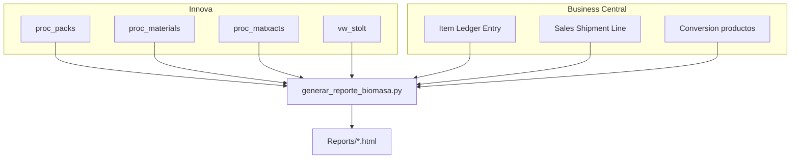

# CALCULO_BIOMASA

Informe de biomasa de planta (**Stolt Sea Farm**): consolida **Innova** (SQL Server) y **Business Central** (Azure SQL) en un HTML interactivo con KPIs, gráficas, tablas exportables a Excel y balance ERP por lote / producto.

**Estado:** proyecto finalizado y validado (marzo–abril 2026).

Documento canónico de reglas: **[PREMISAS.md](PREMISAS.md)**.

## Qué entrega

| Entrega | Descripción |
|---------|-------------|
| Informe HTML | `Reports/reporte_biomasa_YYYYMMDD_YYYYMMDD.html` (autocontenido) |
| Excel | Export desde el navegador (detalle, stock/merma, cruce BC, balance, materiales) |
| Premisas | Reglas de negocio en `PREMISAS.md` y bloque visible en el informe |

### Pestañas del informe

1. **Introducción** — contexto y snapshot del periodo  
2. **Resumen** — KPIs TINA / CAJA / stock / merma / cruce BC  
3. **Gráficas** — evolución diaria, diferencias, composición  
4. **Detalle diario** — tabla día a día  
5. **Balance** — entradas, salidas, stock y merma  
6. **Cruce BC** — Innova ↔ ILE por lote (`number` = `[Lot No.]`)  
7. **Balance BC E/G** — stock diario almacenes E/G (kg): inicial + salidas Innova − ventas  
8. **Balance por tipo (cajas)** — por `Cod. producto`: **entradas = ajustes + (Entry Type 2)**, **ventas = Sale (Entry Type 1)**  
9. **Materiales** — top entradas / salidas  
10. **Debug** — trazas SQL (opcional)

---

## Terminología

| Término | Rol | Innova |
|---------|-----|--------|
| **TINA** | Entrada de biomasa | `proc_packs` · `pkpackaging = 3` |
| **CAJA** | Salida de producto | `proc_packs` · `pkpackaging <> 3` |
| **TINA procesada** | Consumo de tina (entrada a proceso, no salida CAJA) | `proc_matxacts` |

Identidad visual del informe: azul navy / cian / rojo logo Stolt Sea Farm.

---

## Arquitectura



---

## Premisas (resumen)

Detalle completo en **[PREMISAS.md](PREMISAS.md)**.

| # | Concepto | Regla |
|---|----------|-------|
| 1 | Entrada TINA | `pkpackaging = 3` |
| 2 | Salida CAJA | `pkpackaging <> 3` (o NULL) |
| 3 | Stock inventario cierre | Stock inicial + Entradas TINA − TINA procesada |
| 4 | Merma | Entradas TINA − Salidas CAJA − Stock de tinas |
| 5 | TINA procesada | `proc_matxacts` · fecha = `regtime` de la tina |

### Balance BC E/G (kg)

`Stock teórico = Stock inicial + Salidas Innova − Ventas BC`  
Almacenes **E/G**. Histórico ILE desde **2026-01-01**. Encadenamiento diario: cierre día N = apertura día N+1.

### Balance por tipo (cajas)

| Columna | Origen BC |
|---------|-----------|
| Entradas | Positive Adjmt. · `Entry Type = 2` · `ABS(Quantity)` |
| Ventas | Sale · `Entry Type = 1` · `ABS(Quantity)` |
| Producto | `Cod. producto` vía `bc.[Conversion productos]` (`Cod. bascula` = `material` Innova) |

`Stock teórico = Stock inicial + Entradas − Ventas` (cajas; stock = 1 lote ≈ 1 caja).

> **Nota VAP:** el producto VAP distorsiona stock de tinas / merma; limitación conocida sin corrección.

---

## Instalación y ejecución

**Requisitos:** Python 3.11+, red a Innova y BC, `pymssql` (+ `keyring` opcional).

```bash
python -m pip install -r requirements.txt
# o: crear_entorno.bat
```

```bash
# Informe mensual
python generar_reporte_biomasa.py --start 01/04/2026 --end 30/04/2026

# Sin Business Central
python generar_reporte_biomasa.py --start 01/04/2026 --end 30/04/2026 --skip-bc

# Arrastre mensual de stock TINA
python generar_reporte_biomasa.py --start 01/03/2026 --end 31/03/2026 --arrastre-mensual

# Windows
ejecutar_reporte.bat 01/04/2026 30/04/2026
```

### Scripts

| Script | Uso |
|--------|-----|
| `generar_reporte_biomasa.py` | Informe principal (HTML + lógica BC) |
| `validar_dia_salidas.py` | Validación puntual salidas ↔ BC por día |
| `generar_documento_funcional.py` | Regenera `DOCUMENTO_FUNCIONAL_BIOMASA.docx` |
| `crear_entorno.bat` / `ejecutar_reporte.bat` | Ayudas Windows |

### Credenciales (`.env`, no commitear)

```env
DB_SERVER=...
DB_NAME=Innova
DB_USER=...
DB_PASSWORD=...

BC_SERVER=...
BC_DATABASE=...
BC_USER=...
BC_PASSWORD=...
```

También se admiten líneas BC informales: `Server Name:`, `Database:`, `User:`, `Password:`.

---

## Totales de referencia

Regenerados con la lógica final (sin arrastre salvo donde se indique).

### Marzo 2026

| Métrica | Valor |
|---------|-------|
| Entradas TINA | 654.953,24 kg |
| TINA procesada | 424.729,00 kg |
| Salidas CAJA | 474.322,21 kg · 77.531 cajas |
| Stock de tinas | 225.334,24 kg |
| Merma | −44.703,21 kg (−6,83 %) |
| Cruce BC lotes | 69.767 / 77.531 (89,99 %) |
| Balance BC E/G (check) | −568,49 kg |
| Balance por tipo cajas | Entradas 78.674 · Ventas 76.278 · Check −145 |

### Abril 2026

| Métrica | Valor |
|---------|-------|
| Entradas TINA | 518.532,75 kg |
| TINA procesada | 353.246,00 kg |
| Salidas CAJA | 410.802,15 kg · 71.174 cajas |
| Stock de tinas | 169.158,75 kg |
| Merma | −61.428,15 kg (−11,85 %) |
| Cruce BC lotes | 66.384 / 71.174 (93,27 %) |
| Balance BC E/G (check) | −70,56 kg |
| Balance por tipo cajas | Entradas 74.352 · Ventas 73.320 · Check 2.526 |

---

## Estructura del repositorio

```
CALCULO_BIOMASA/
├── generar_reporte_biomasa.py      # Informe HTML + Innova + BC
├── validar_dia_salidas.py          # Validación diaria (utilidad)
├── generar_documento_funcional.py  # Word funcional
├── DOCUMENTO_FUNCIONAL_BIOMASA.docx
├── PREMISAS.md                     # Reglas de negocio
├── README.md
├── requirements.txt
├── stolt_logo.svg
├── crear_entorno.bat
├── ejecutar_reporte.bat
├── .env                            # Local (gitignored)
└── Reports/                        # HTML generados (gitignored)
```

---

## Mantenimiento

1. Actualizar maestro Innova / reglas en **PREMISAS.md**.  
2. Ajustar `PREMISA_*` / `SQL_*` en `generar_reporte_biomasa.py`.  
3. Regenerar un mes de referencia y contrastar totales.  
4. Si aplica: `python generar_documento_funcional.py`.

**Notas:** fechas `dd/mm/aaaa`; consulta BC puede tardar varios minutos (timeout default 600–1800 s según bloque).
