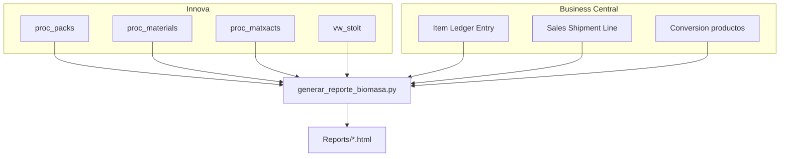

# CALCULO_BIOMASA

Informe de biomasa de planta (**Stolt Sea Farm**): consolida **Innova** (SQL Server) y **Business Central** (Azure SQL) en un HTML interactivo con KPIs, gráficas, tablas exportables a Excel y balance ERP por lote / producto.

**Estado:** proyecto finalizado y validado (marzo–abril 2026).

Documento canónico de reglas: **[PREMISAS.md](PREMISAS.md)**.

---

## Despliegue y ejecución en empresa (Windows)

Mecanismo oficial de distribución: carpeta del proyecto + scripts `.bat`.

| Script | Función |
|--------|---------|
| **`crear_entorno.bat`** | Primera instalación / reparación: Python, `.venv`, dependencias |
| **`configurar_credenciales.bat`** | Guarda Innova/BC ocultas en el perfil del usuario (una vez) |
| **`ejecutar_reporte.bat`** | Genera el informe del periodo (y abre el HTML) |
| **`Iniciar_Reporte_Biomasa.bat`** | Menú: instalar, credenciales, generar, abrir último informe |

### Requisitos en el PC

- Windows 10/11
- **Python 3.11+** instalado (marcar *Add python.exe to PATH*)
- Red corporativa a **Innova** y **Business Central**
- Permiso de escritura en la carpeta del proyecto (`.venv`, `Reports\`) y en `%LOCALAPPDATA%`

### 1. Distribuir la aplicación

1. Copiar la carpeta del repositorio a la ruta de trabajo del usuario, por ejemplo:
   - `C:\Apps\CALCULO_BIOMASA\`
   - o una unidad de red mapeada (evitar UNC directo `\\servidor\...` si el venv falla)
2. **No** distribuir secretos por correo/chat. Cada puesto configura credenciales con `configurar_credenciales.bat`.
3. Opcional: clonar desde Git si el equipo tiene acceso al repositorio.

Archivos que **sí** se distribuyen: código `.py`, `.bat`, `requirements.txt`, `.env.example`, `PREMISAS.md`, `stolt_logo.svg`, etc.  
Archivos **locales** (no versionar / no compartir): `.venv\`, `Reports\*.html`, `.env` (si se usa), credenciales en `%LOCALAPPDATA%`.

### 2. Instalación en cada puesto (una vez)

```bat
crear_entorno.bat
configurar_credenciales.bat
```

1. `crear_entorno.bat` — comprueba Python, crea `.venv`, instala dependencias  
2. `configurar_credenciales.bat` — **solo la primera vez** (o si cambian passwords)

**No hay que rehacer el `.env` al actualizar el código.** Las credenciales viven fuera de la carpeta del proyecto, ocultas:

`%LOCALAPPDATA%\Stolt\CALCULO_BIOMASA\credentials.env`

También se guardan en **Windows Credential Manager** (vía `keyring`).  
Si ya existe un `.env` en el proyecto, el configurador lo puede reutilizar como valores iniciales.

### 3. Generar un informe

**Opción A — menú (recomendado):**

```bat
Iniciar_Reporte_Biomasa.bat
```

**Opción B — con fechas:**

```bat
ejecutar_reporte.bat 01/04/2026 30/04/2026
```

**Opción C — pide fechas:**

```bat
ejecutar_reporte.bat
```

Al terminar bien, abre el HTML más reciente de `Reports\`.

### 4. Credenciales (ocultas y persistentes)

| Dónde | Qué guarda |
|-------|------------|
| `%LOCALAPPDATA%\Stolt\CALCULO_BIOMASA\credentials.env` | Servidores, usuarios y passwords (**fichero oculto**) |
| Windows Credential Manager | Passwords Innova/BC |
| `.env` en la carpeta (opcional) | Compatibilidad; **no se versiona** |

Prioridad de carga: perfil de usuario → `.env` del proyecto → keyring.

Para cambiar passwords: `configurar_credenciales.bat` (Enter mantiene el valor actual).  
Plantilla sin secretos: `.env.example`.

### 5. Problemas frecuentes

| Síntoma | Qué hacer |
|---------|-----------|
| *No se encontro Python* | Instalar Python 3.11+ con PATH |
| Error de login Innova/BC | Ejecutar `configurar_credenciales.bat` y revisar red/VPN |
| Timeout BC | Normal en redes lentas; reintentar o subir `BC_TIMEOUT` |
| No abre el HTML | Mirar `Reports\reporte_biomasa_*.html` y abrirlo a mano |
| Ejecución desde `\\servidor\share` | Mapear letra de unidad o copiar a disco local |
| Credenciales perdidas tras actualizar codigo | No deberian perderse: estan en `%LOCALAPPDATA%` |

---

## Qué entrega el informe

| Entrega | Descripción |
|---------|-------------|
| Informe HTML | `Reports/reporte_biomasa_YYYYMMDD_YYYYMMDD.html` (autocontenido) |
| Excel | Export desde el navegador (detalle, stock/merma, cruce BC, balance, materiales) |
| Premisas | Reglas en `PREMISAS.md` y bloque visible en el informe |

### Pestañas

1. **Introducción** — contexto y snapshot del periodo  
2. **Resumen** — KPIs TINA / CAJA / stock / merma / cruce BC  
3. **Gráficas** — evolución diaria, diferencias, composición  
4. **Detalle diario** — tabla día a día  
5. **Balance** — entradas, salidas, stock y merma  
6. **Cruce BC** — Innova ↔ ILE por lote (`number` = `[Lot No.]`)  
7. **Balance BC E/G** — stock diario almacenes E/G (kg)  
8. **Balance por tipo (cajas)** — entradas = ajustes + (Type 2); ventas = Sale (Type 1)  
9. **Materiales** — top entradas / salidas  
10. **Debug** — trazas SQL (opcional)

---

## Terminología

| Término | Rol | Innova |
|---------|-----|--------|
| **TINA** | Entrada de biomasa | `proc_packs` · `pkpackaging = 3` |
| **CAJA** | Salida de producto | `proc_packs` · `pkpackaging <> 3` |
| **TINA procesada** | Consumo de tina (no es salida CAJA) | `proc_matxacts` |

Identidad visual: azul navy / cian / rojo logo Stolt Sea Farm.

---

## Arquitectura



---

## Premisas (resumen)

Detalle completo en **[PREMISAS.md](PREMISAS.md)**.

| # | Concepto | Regla |
|---|----------|-------|
| 1 | Entrada TINA | `pkpackaging = 3` |
| 2 | Salida CAJA | `pkpackaging <> 3` (o NULL) |
| 3 | Stock inventario cierre | Stock inicial + Entradas TINA − TINA procesada |
| 4 | Merma | Entradas TINA − Salidas CAJA − Stock de tinas |
| 5 | TINA procesada | `proc_matxacts` · fecha = `regtime` de la tina |

### Balance BC E/G (kg)

`Stock teórico = Stock inicial + Salidas Innova − Ventas BC`  
Almacenes **E/G**. Histórico ILE desde **2026-01-01**. Encadenamiento: cierre día N = apertura día N+1.

### Balance por tipo (cajas)

| Columna | Origen BC |
|---------|-----------|
| Entradas | Positive Adjmt. · `Entry Type = 2` · `ABS(Quantity)` |
| Ventas | Sale · `Entry Type = 1` · `ABS(Quantity)` |
| Producto | `Cod. producto` vía `bc.[Conversion productos]` (`Cod. bascula` = `material` Innova) |

`Stock teórico = Stock inicial + Entradas − Ventas`.

> **Nota VAP:** el producto VAP distorsiona stock de tinas / merma; limitación conocida.

---

## Uso avanzado (Python / CLI)

Con el entorno ya creado:

```bat
.venv\Scripts\python.exe generar_reporte_biomasa.py --start 01/04/2026 --end 30/04/2026
.venv\Scripts\python.exe generar_reporte_biomasa.py --start 01/04/2026 --end 30/04/2026 --skip-bc
.venv\Scripts\python.exe generar_reporte_biomasa.py --start 01/03/2026 --end 31/03/2026 --arrastre-mensual
```

### Otros scripts

| Script | Uso |
|--------|-----|
| `generar_reporte_biomasa.py` | Informe principal |
| `validar_dia_salidas.py` | Validación puntual salidas ↔ BC por día |
| `generar_documento_funcional.py` | Regenera `DOCUMENTO_FUNCIONAL_BIOMASA.docx` |

---

## Totales de referencia

### Marzo 2026

| Métrica | Valor |
|---------|-------|
| Entradas TINA | 654.953,24 kg |
| TINA procesada | 424.729,00 kg |
| Salidas CAJA | 474.322,21 kg · 77.531 cajas |
| Stock de tinas | 225.334,24 kg |
| Merma | −44.703,21 kg (−6,83 %) |
| Cruce BC lotes | 69.767 / 77.531 (89,99 %) |
| Balance BC E/G (check) | −568,49 kg |
| Balance por tipo cajas | Entradas 78.674 · Ventas 76.278 · Check −145 |

### Abril 2026

| Métrica | Valor |
|---------|-------|
| Entradas TINA | 518.532,75 kg |
| TINA procesada | 353.246,00 kg |
| Salidas CAJA | 410.802,15 kg · 71.174 cajas |
| Stock de tinas | 169.158,75 kg |
| Merma | −61.428,15 kg (−11,85 %) |
| Cruce BC lotes | 66.384 / 71.174 (93,27 %) |
| Balance BC E/G (check) | −70,56 kg |
| Balance por tipo cajas | Entradas 74.352 · Ventas 73.320 · Check 2.526 |

---

## Estructura del repositorio

```
CALCULO_BIOMASA/
├── Iniciar_Reporte_Biomasa.bat     # Menú de usuario
├── crear_entorno.bat               # Instalación / reparación
├── configurar_credenciales.bat     # Credenciales ocultas (perfil usuario)
├── configurar_credenciales.py
├── ejecutar_reporte.bat            # Generar informe
├── generar_reporte_biomasa.py
├── validar_dia_salidas.py
├── generar_documento_funcional.py
├── DOCUMENTO_FUNCIONAL_BIOMASA.docx
├── PREMISAS.md
├── README.md
├── requirements.txt
├── .env.example                    # Plantilla (sin secretos)
├── stolt_logo.svg
├── Reports/                        # HTML generados (gitignored)
└── logs/                           # Errores (gitignored)

# Fuera del proyecto (por usuario Windows):
# %LOCALAPPDATA%\Stolt\CALCULO_BIOMASA\credentials.env  (oculto)
```

---

## Mantenimiento

1. Actualizar maestro Innova / reglas en **PREMISAS.md**.  
2. Ajustar `PREMISA_*` / `SQL_*` en `generar_reporte_biomasa.py`.  
3. En cada puesto: volver a ejecutar `crear_entorno.bat` tras cambios en `requirements.txt`.  
4. Regenerar un mes de referencia y contrastar totales.  
5. Si aplica: `python generar_documento_funcional.py`.

**Notas:** fechas `dd/mm/aaaa`; la consulta BC puede tardar varios minutos.
