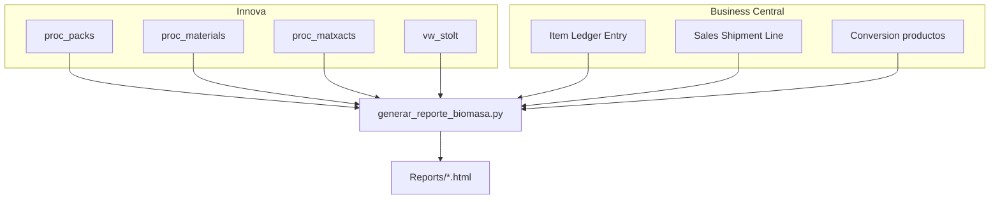

# CALCULO_BIOMASA

Informe de biomasa de planta (**Stolt Sea Farm**): consolida **Innova** (SQL Server) y **Business Central** (API OAuth / OData, o Azure SQL) en un HTML interactivo con KPIs, gráficas, tablas exportables a Excel y balance ERP por producto (sin detalle por lote en el HTML, para mantenerlo ligero).

**Estado:** proyecto **cerrado / operativo** (referencia validada: **abril 2026**).  
Fuente BC recomendada: **`BC_SOURCE=api`** (API AL custom cuando exista; puente ODataV4 + enrich Innova).

| Documento | Contenido |
|-----------|-----------|
| **[INSTRUCCIONES.md](INSTRUCCIONES.md)** | Manual de uso, arquitectura y checklist de cierre |
| **[PREMISAS.md](PREMISAS.md)** | Reglas de negocio canónicas |
| **[docs/CAMBIOS_LOCAL.md](docs/CAMBIOS_LOCAL.md)** | Historial de cambios guardados en local |
| **[docs/BC_API_AL_CONTRACT.md](docs/BC_API_AL_CONTRACT.md)** | Recomendación: no usar API v2.0 sin lote/almacén (evitar errores) |
| `docs/CREDENCIALES_LOCAL.md` | Secretos locales (**no versionado**) |

---

## Despliegue y ejecución en empresa (Windows)

Mecanismo oficial de distribución: carpeta del proyecto + scripts `.bat`.

| Script | Función |
|--------|---------|
| **`crear_entorno.bat`** | Primera instalación / reparación: Python, `.venv`, dependencias |
| **`configurar_credenciales.bat`** | Guarda Innova/BC ocultas en el perfil del usuario (una vez) |
| **`ejecutar_reporte.bat`** | Genera el informe del periodo (y abre el HTML) |
| **`Iniciar_Reporte_Biomasa.bat`** | Menú: instalar, credenciales, generar, abrir último informe |

### Requisitos en el PC

- Windows 10/11
- **Python 3.11+** instalado (marcar *Add python.exe to PATH*)
- Red corporativa a **Innova** y **Business Central**
- Permiso de escritura en la carpeta del proyecto (`.venv`, `Reports\`, `.env`)

### 1. Distribuir la aplicación

1. Copiar la carpeta del repositorio a la ruta de trabajo del usuario, por ejemplo:
   - `C:\Apps\CALCULO_BIOMASA\`
   - o una unidad de red mapeada (evitar UNC directo `\\servidor\...` si el venv falla)
2. **No** distribuir el `.env` con secretos por correo/chat. Cada puesto mantiene su propio `.env` local.
3. Opcional: clonar desde Git si el equipo tiene acceso al repositorio.

Archivos que **sí** se distribuyen: código `.py`, `.bat`, `requirements.txt`, `.env.example`, `PREMISAS.md`, `stolt_logo.svg`, etc.  
Archivos **locales** (no versionar / no compartir): `.venv\`, `Reports\*.html`, `.env`.

### 2. Instalación en cada puesto (una vez)

```bat
crear_entorno.bat
```

Luego editar `.env` (opción 2 del menú o Bloc de notas).

1. `crear_entorno.bat` — comprueba Python, crea `.venv`, instala dependencias  
2. Editar **`.env`** en la carpeta del proyecto (opción 2 del menú o Bloc de notas)

Las credenciales van **fijas** en:

`.env`

No se preguntan por pantalla. Plantilla: `.env.example` (copiar a `.env` si no existe).

### 3. Generar un informe

**Opción A — menú (recomendado):**

```bat
Iniciar_Reporte_Biomasa.bat
```

**Opción B — con fechas:**

```bat
ejecutar_reporte.bat 01/04/2026 30/04/2026
```

**Opción C — pide fechas:**

```bat
ejecutar_reporte.bat
```

Al terminar bien, abre el HTML más reciente de `Reports\`.

### 4. Credenciales (fijas en `.env`)

| Dónde | Qué guarda |
|-------|------------|
| `.env` en la carpeta del proyecto | Innova SQL; BC API (`CLIENT_ID`/`TENANT_ID`/`CLIENT_SECRET`, `BC_SOURCE=api`) y/o BC SQL (`BC_SERVER`…) |

El informe solo lee `.env`. Para cambiar passwords: editar `.env` a mano.  
Plantilla sin secretos: `.env.example`. La opción 2 del menú crea `.env` desde la plantilla y lo abre en el Bloc de notas.

Con `BC_SOURCE=api` no hace falta la réplica Azure SQL para el ILE (sí puede usarse opcionalmente para `Conversion productos`). La API estándar v2.0 no incluye lote/almacén; el cliente usa la API AL custom si está publicada, si no ODataV4.

### 5. Problemas frecuentes

| Síntoma | Qué hacer |
|---------|-----------|
| *No se encontro Python* | Instalar Python 3.11+ o indicar la ruta en `crear_entorno.bat` |
| Error de login Innova/BC | Ejecutar `configurar_credenciales.bat` y revisar red/VPN |
| Timeout BC | Normal en redes lentas; reintentar o subir `BC_TIMEOUT` |
| No abre el HTML | Mirar `Reports\reporte_biomasa_*.html` y abrirlo a mano |
| Ejecución desde `\\servidor\share` | Mapear letra de unidad o copiar a disco local |
| Permission denied en AppData | Ya no se usa AppData; todo va en `.env` de la carpeta del proyecto |
| Credenciales tras actualizar codigo | Conservar el `.env` local al copiar/actualizar el codigo |

---

### Acceso multi-usuario Innova

Cada puesto usa su propio `DB_USER` / `DB_PASSWORD` en `.env` (no compartir `sa`).

| Quien | Accion |
|-------|--------|
| **DBA / IT** | Crear login SQL solo-lectura: `python scripts/crear_usuario_innova_biomasa.py --update-env` (script SQL en `scripts/crear_usuario_innova_biomasa.sql`) |
| **Permisos** | `db_datareader` sobre `Innova` + DENY escritura en `dbo` (`proc_packs`, `proc_materials`, `proc_matxacts`, `vw_stolt`) |
| **Usuario app** | Por defecto `biomasa_ro` (solo lectura); por persona p.ej. `AEV` |
| **Cada usuario** | `configurar_credenciales.bat` / editar `.env` |
| **Despliegue** | No distribuir `.env` con secretos |
| **Credenciales locales** | Documento `docs/CREDENCIALES_LOCAL.md` (gitignored) — informe + modo diseño/DBA |

Opcional futuro: autenticacion Windows (`Trusted_Connection`) para no guardar password SQL.

---

## Qué entrega el informe

| Entrega | Descripción |
|---------|-------------|
| Informe HTML | `Reports/reporte_biomasa_YYYYMMDD_YYYYMMDD.html` (autocontenido) |
| Excel | Export desde el navegador (detalle, stock/merma, cruce BC, balances, análisis ILE, materiales) |
| Premisas | Reglas en `PREMISAS.md` y bloque visible en el informe |
| Definiciones KPI | `docs/KPI_DEFINICIONES.md` (textos de ayuda fuera del informe) |

### Pestañas

1. **Introducción** — contexto y snapshot del periodo  
2. **Resumen** — KPIs TINA / CAJA / stock / merma / cruce BC  
3. **Gráficas** — evolución diaria, diferencias, composición  
4. **Detalle diario** — tabla día a día  
5. **Balance** — entradas, salidas, stock y merma  
6. **Cruce BC** — Innova ↔ ILE por lote (`number` = `[Lot No.]`)  
7. **Balance BC E/G/Z** — Inicial + Producción (Salidas CAJA) − 1ª salida; merma peso Innova−BC  
8. **Balance por tipo (cajas)** — CHECK = real − teórico; estados A/B/C; Item No. BC si el lote está en ILE (1 lote = 1 caja)  
9. **Movimientos ILE (T2/1/3)** — auditoría `ABS(Quantity)` / `ABS(Kilos)`  
10. **Stock inicial BC E/G/Z** — cajas y kg por tipo a la fecha de inicio  
11. **Stock final BC E/G/Z** — producción del periodo pendiente de venta a la fecha de fin  
12. **Análisis ILE (1/2/3)** — Type 1/2/3 por usuario/día/producto  
13. **Materiales** — top entradas / salidas  
14. **Debug** — trazas SQL (opcional)

Al pie del informe (una sola vez): nota VAP + nota de ajustes negativos Type 3.

Manual completo: **[INSTRUCCIONES.md](INSTRUCCIONES.md)**.

---

## Terminología

| Término | Rol | Innova |
|---------|-----|--------|
| **TINA** | Entrada de biomasa | `proc_packs` · `pkpackaging = 3` |
| **CAJA** | Salida de producto (proceso) | `proc_packs` · `pkpackaging <> 3` |
| **Producción (Salidas CAJA)** | En balance BC E/G/Z: **alta de stock** E/G por coincidencia de lote Innova∩BC | `number`/`prday` = `Lot No.`/`Fecha empaque` |
| **TINA procesada** | Consumo de tina (no es salida CAJA) | `proc_matxacts` |

Identidad visual: azul navy / cian / rojo logo Stolt Sea Farm.

---

## Arquitectura



---

## Premisas (resumen)

Detalle completo en **[PREMISAS.md](PREMISAS.md)**.

| # | Concepto | Regla |
|---|----------|-------|
| 1 | Entrada TINA | `pkpackaging = 3` |
| 2 | Salida CAJA | `pkpackaging <> 3` (o NULL) |
| 3 | Stock inventario cierre | Stock inicial + Entradas TINA − TINA procesada |
| 4 | Merma | Entradas TINA − Salidas CAJA − Stock de tinas |
| 5 | TINA procesada | `proc_matxacts` · fecha = `regtime` de la tina |

### Balance BC E/G/Z (kg)

`Stock teórico = Stock inicial + Salidas Innova − Ventas BC`  
Almacenes **E/G**. Histórico ILE desde **2026-01-01**. Encadenamiento: cierre día N = apertura día N+1.

### Balance por tipo (cajas)

| Columna | Origen BC |
|---------|-----------|
| Entradas | Positive Adjmt. · `Entry Type = 2` · `ABS(Quantity)` |
| Ventas | Sale · `Entry Type = 1` · `ABS(Quantity)` |
| Ajustes neg. | Negative Adjmt. · `Entry Type = 3` · `ABS(Quantity)` |
| Producto | **`Item No.` del lote ILE** (prioridad). Conversion bascula solo si no hay Item No. |

`Stock teórico = Stock inicial + Entradas − Ventas − Ajustes neg.`  
Stock real = lotes en stock (1 lote = 1 caja). El check de cajas **no es comparable 1:1** con el de kg (fórmulas y unidades distintas).

### Análisis ILE (pestaña)

Validación de integridad Type **1 / 2 / 3** en E/G: Quantity vs nº de lotes, solapes venta+ajuste neg., Type 3 con `Kilos = 0`, y contraste check kg vs check cajas. Usuario BC = campo ILE `[Id. usuario]`.

> **Nota VAP:** el producto VAP distorsiona stock de tinas / merma; limitación conocida (pie del informe).

---

## Uso avanzado (Python / CLI)

Con el entorno ya creado:

```bat
.venv\Scripts\python.exe generar_reporte_biomasa.py --start 01/04/2026 --end 30/04/2026
.venv\Scripts\python.exe generar_reporte_biomasa.py --start 01/04/2026 --end 30/04/2026 --skip-bc
.venv\Scripts\python.exe generar_reporte_biomasa.py --start 01/03/2026 --end 31/03/2026 --arrastre-mensual

# Contraste lote Innova (prday/weight) vs BC (Fecha empaque/Kilos)
.venv\Scripts\python.exe contrastar_lote_innova_bc.py --start 01/04/2026 --end 30/04/2026
```

### Otros scripts

| Script | Uso |
|--------|-----|
| `generar_reporte_biomasa.py` | Informe principal |
| `contrastar_lote_innova_bc.py` | Contraste por lote: Innova prday/weight vs BC Fecha empaque/Kilos |
| `validar_dia_salidas.py` | Validación puntual salidas ↔ BC por día |
| `generar_documento_funcional.py` | Regenera `DOCUMENTO_FUNCIONAL_BIOMASA.docx` |

---

## Totales de referencia

### Marzo 2026

| Métrica | Valor |
|---------|-------|
| Entradas TINA | 654.953,24 kg |
| TINA procesada | 424.729,00 kg |
| Salidas CAJA | 474.322,21 kg · 77.531 cajas |
| Stock de tinas | 225.334,24 kg |
| Merma | −44.703,21 kg (−6,83 %) |
| Cruce BC lotes | 69.767 / 77.531 (89,99 %) |
| Balance BC E/G/Z (check) | −568,49 kg |
| Balance por tipo cajas | Entradas 78.674 · Ventas 76.278 · Check −145 |

### Abril 2026

| Métrica | Valor |
|---------|-------|
| Entradas TINA | 518.532,75 kg |
| TINA procesada | 353.246,00 kg |
| Salidas CAJA | 410.802,15 kg · 71.174 cajas |
| Stock de tinas | 169.158,75 kg |
| Merma | −61.428,15 kg (−11,85 %) |
| Cruce BC lotes | 66.384 / 71.174 (93,27 %) |
| Balance BC E/G/Z (check) | −70,56 kg |
| Balance por tipo cajas | Inicial 6.829 · Entradas 74.352 · Ventas 73.320 · Ajustes neg. 3.884 · Teórico 3.977 · Real 4.205 · Check **−228** |
| Análisis Type 3 | 3 usuarios · top **ACZ** · ~98 % movimientos Type 3 con Kilos=0 |

---

## Estructura del repositorio

```
CALCULO_BIOMASA/
├── Iniciar_Reporte_Biomasa.bat     # Menú de usuario
├── crear_entorno.bat               # Instalación / reparación
├── configurar_credenciales.bat     # Credenciales ocultas (perfil usuario)
├── configurar_credenciales.py
├── ejecutar_reporte.bat            # Generar informe
├── generar_reporte_biomasa.py
├── contrastar_lote_innova_bc.py
├── validar_dia_salidas.py
├── generar_documento_funcional.py
├── DOCUMENTO_FUNCIONAL_BIOMASA.docx
├── PREMISAS.md                     # Reglas canónicas
├── README.md
├── requirements.txt
├── .env.example                    # Plantilla (sin secretos)
├── .env                            # Credenciales locales (NO versionar)
├── stolt_logo.svg
├── Reports/                        # HTML generados (gitignored)
└── logs/                           # Errores (gitignored)
```

---

## Mantenimiento

1. Actualizar maestro Innova / reglas en **PREMISAS.md**.  
2. Ajustar `PREMISA_*` / `SQL_*` en `generar_reporte_biomasa.py`.  
3. En cada puesto: volver a ejecutar `crear_entorno.bat` tras cambios en `requirements.txt`.  
4. Regenerar un mes de referencia y contrastar totales.  
5. Si aplica: `python generar_documento_funcional.py`.

**Notas:** fechas `dd/mm/aaaa`; la consulta BC puede tardar varios minutos.
